# Travelite: AI Virtual Tour Guide & Trip Planner

Travelite is an AI-powered virtual tour guide and trip planning platform that provides users with customized trips based on their preferences. It also allows users to view past trips and suggests new trips using an ML model that analyzes previously created trips.

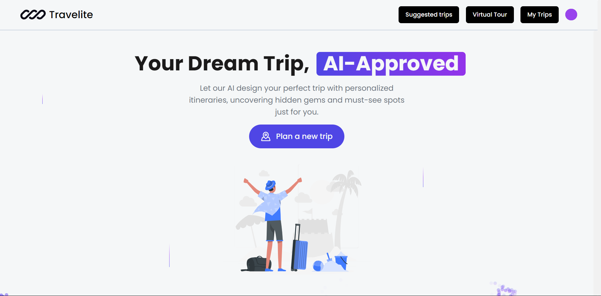
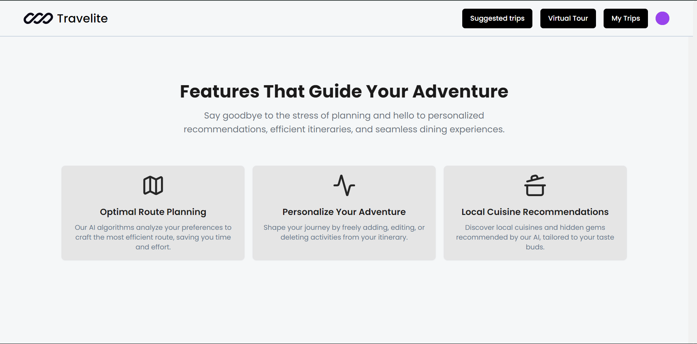

## Table of Contents
- [Features](#features)
- [Technologies Used](#technologies-used)
- [Getting Started](#getting-started)
- [Installation](#installation)
- [Usage](#usage)
- [Authentication](#authentication)
- [UI & Design](#ui--design)
- [Contributing](#contributing)
- [License](#license)

## Features

- **AI Virtual Tour Guide**: Experience destinations with high-quality images, street views, and audio narration.
- **AI-Based Trip Planner**: Generate personalized trips by inputting your destination, budget, and group size.
- **View Past Trips**: Access and manage all the trips you’ve created previously.
- **ML-Based Trip Suggestions**: Receive up to 3 suggested trips based on your most recent trip, leveraging a machine learning model.
- **Integrated Chatbot**: Use a chatbot for assistance, information, and QR code-based ticket booking.
- **Virtual Street View**: Explore locations through a virtual tour guide, including street views, detailed images, and educational audio content.
- **Multilingual Audio Descriptions**: Access audio explanations of significant features at each location in multiple languages.
- **Interactive Trip Map**: View an interactive map of your trip location using Leaflet.

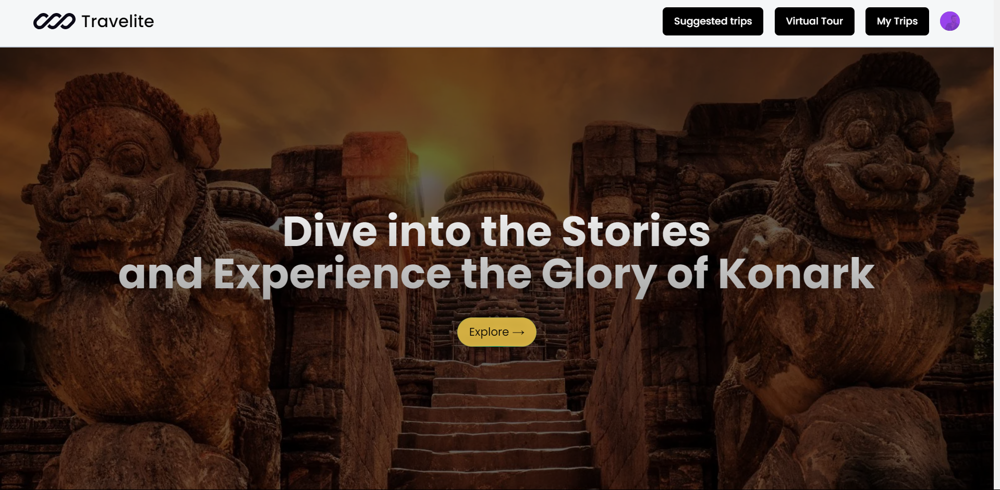
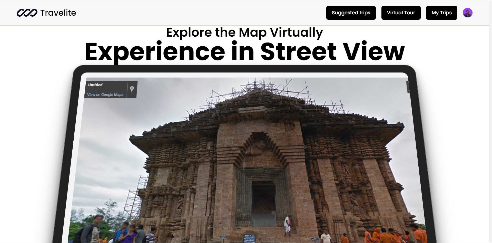
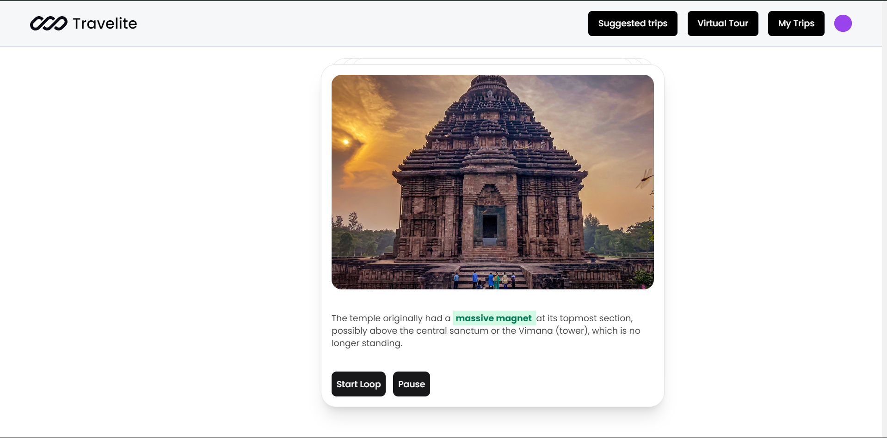

## Technologies Used

- **Frontend**: 
  - React.js
  - Next.js
  - Tailwind CSS
  - Acternity UI
  - shadcn (component library)
  - Framer Motion (for animations)
  - Leaflet (for interactive maps)
  
- **Backend**: 
  - Next.js
  - Node.js
  - Express.js
  - Python (for ML models)
  
- **Database**:
  - Firebase (for storing trip data)
  
- **Machine Learning**: 
  - Python (ML models for trip recommendations)

- **AI**
  - For creating using trip using gemini API 
  
- **APIs**:
  - Gemini API (for trip planning)
  - Unsplash API (for destination images)
  - Google Maps API (for street view images of destination)
  
- **Authentication**:
  - Clerk (for secure user authentication and session management)

## Getting Started

Follow the instructions below to set up and run Travelite locally.

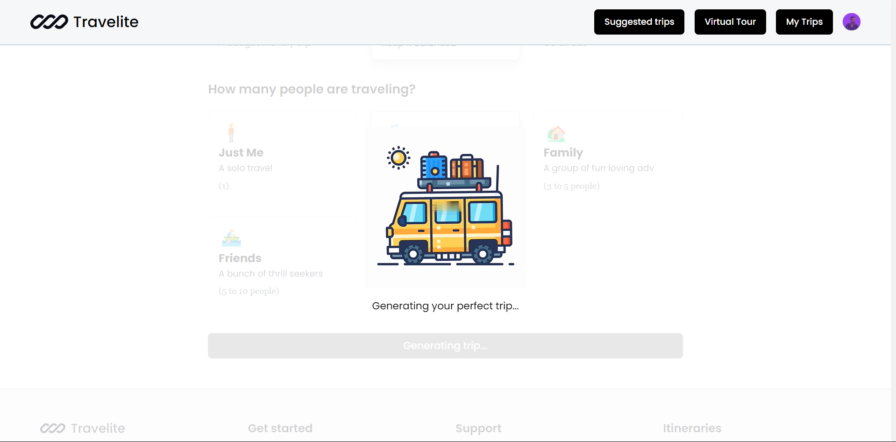

### Prerequisites

- Node.js (>=14.x)
- Firebase account
- Python 3.x
- Git

### Installation

1. **Clone the repository:**
   ```bash
   git clone https://github.com/Akshansh029/travelite.git
   cd travelite
   ```

2. **Install dependencies:**
   - Install frontend and backend dependencies:
     ```bash
     npm install
     ```

   - Install Python dependencies for the ML model:
     ```bash
     pip install -r requirements.txt
     ```

3. **Set up environment variables:**
   Create a `.env` file in the root directory with the following variables:
   ```
   FIREBASE_API_KEY=<Your Firebase API Key>
   FIREBASE_AUTH_DOMAIN=<Your Firebase Auth Domain>
   FIREBASE_PROJECT_ID=<Your Firebase Project ID>
   FIREBASE_STORAGE_BUCKET=<Your Firebase Storage Bucket>
   FIREBASE_MESSAGING_SENDER_ID=<Your Firebase Messaging Sender ID>
   FIREBASE_APP_ID=<Your Firebase App ID>
   GEMINI_API_KEY=<Your Gemini API Key>
   UNSPLASH_API_KEY=<Your Unsplash API Key>
   GOOGLE_MAPS_API_KEY=<Your Google Maps API Key>
   CLERK_FRONTEND_API=<Your Clerk Frontend API Key>
   CLERK_API_KEY=<Your Clerk Backend API Key>
   ```

4. **Run the development server:**
   ```bash
   npm run dev
   ```

5. **Start the ML model server (Python):**
   ```bash
   python ml_model.py
   ```

6. **Access the app:**
   The app should now be running at `http://localhost:3000`.

## Usage

### 1. **Create a Trip**:
   - Log in using Clerk's authentication system and provide your destination, budget, and group size to generate a new trip plan using the AI Trip Planner.
   - After the AI generates the trip, it will recommend:
     - **Up to 3 Hotels**: Each hotel card displays:
       - **Rating**: The hotel's user rating.
       - **Price**: The cost per night.
       - **Address**: The hotel's location.
     - Clicking on a hotel card will navigate you to Google Maps, showing the hotel's location and directions.
     - **Day-Wise Activities and Places to Visit**: Each activity/place includes:
       - **Cost**: The expense associated with the activity/place.
       - **Rating**: The user rating.
       - **Description**: A brief overview of the activity/place.
       - **Address**: The location of the activity/place.
     - Clicking on an activity/place card will open its address on Google Maps, providing directions and additional details.
   - **Trip Map**: View an interactive map of the trip location using Leaflet, which displays all recommended hotels, activities, and places to visit on the map.

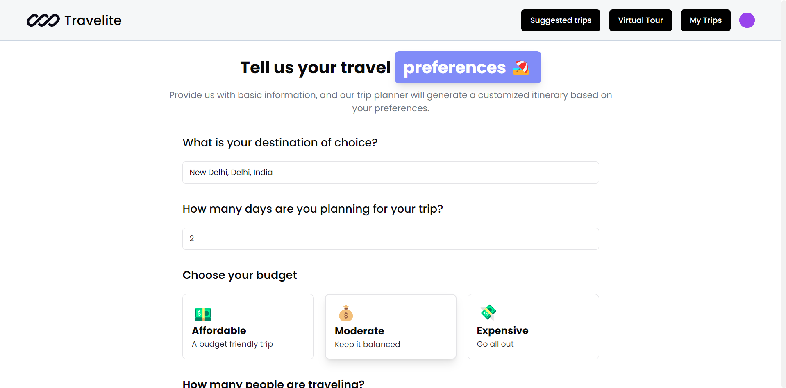
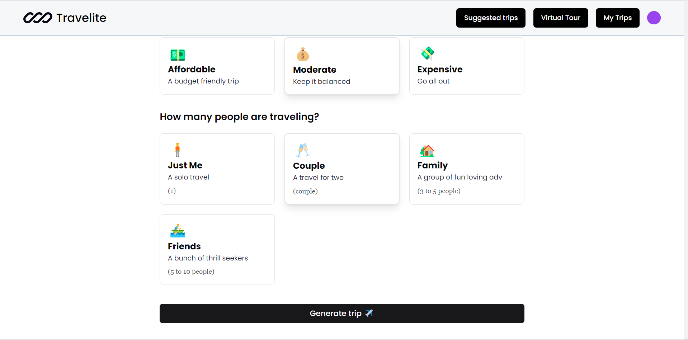

### 2. **View Past Trips**:
   - Navigate to the "My Trips" section to view all previously created trips.

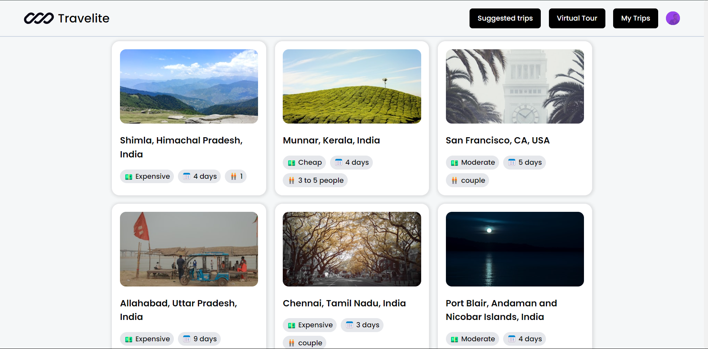

### 3. **AI Trip Suggestions**:
   - After creating a trip, view 3 trip suggestions based on your last trip, recommended using the ML model.

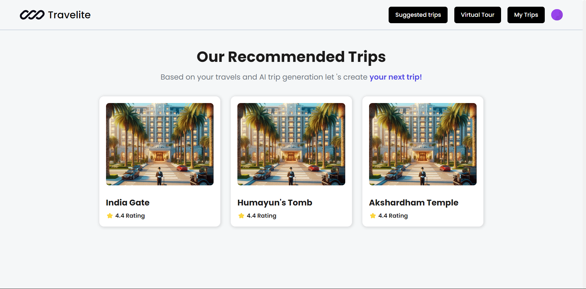

### 4. **Virtual Tour Guide**:
   - **Street View**: Explore locations through a virtual tour. For example, if you create a trip to Konark Temple:
     - **Carousel Photos**: View 2-3 high-quality images showcasing the beauty of Konark Temple.
     - **Street View Section**: Experience a virtual tour of the temple's surroundings as if you were there, without actually visiting.
     - **Audio Descriptions**: Listen to multilingual audio explanations about the significance of various sculptures and features of Konark Temple, enhancing your understanding of the place.


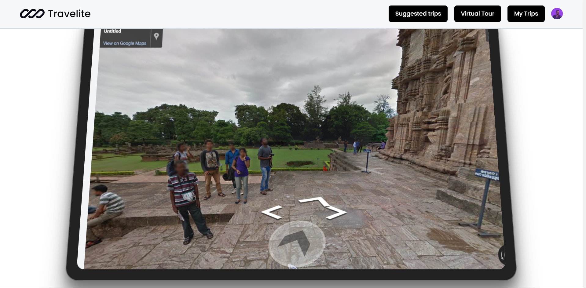


## Authentication

Travelite uses [Clerk](https://clerk.dev) for user authentication, providing an easy and secure way to manage user logins, signups, and sessions. Clerk offers features such as passwordless authentication, user management, and secure session storage.

To configure Clerk:

1. Sign up for a Clerk account at [Clerk.dev](https://clerk.dev).
2. Create a new application and retrieve your **Frontend API** and **Backend API** keys.
3. Add the keys to your `.env` file:
   ```
   CLERK_FRONTEND_API=<Your Clerk Frontend API Key>
   CLERK_API_KEY=<Your Clerk Backend API Key>
   ```
4. Clerk handles the full authentication flow for user signups and logins, ensuring a secure user experience.

## UI & Design

Travelite's user interface is powered by **Acternity UI** and **shadcn**, a modern and responsive UI component library. This combination provides a clean, minimalistic design with a focus on user experience and performance.

- **Acternity UI**: A custom UI framework providing the base design principles for the app.
- **shadcn**: A component library integrated into the app for rapid UI development and seamless design consistency.
- **Framer Motion**: For dynamic animations and transitions to enhance the user experience.
- **Leaflet**: For interactive and dynamic maps displaying trip locations and recommendations.

## Contributing

We welcome contributions to improve Travelite! If you'd like to contribute, please fork the repository and create a pull request.

1. Fork the repository
2. Create a new feature branch
   ```bash
   git checkout -b feature-branch-name
   ```
3. Commit your changes
   ```bash
   git commit -m "Add some feature"
   ```
4. Push to the branch
   ```bash
   git push origin feature-branch-name
   ```
5. Open a pull request

